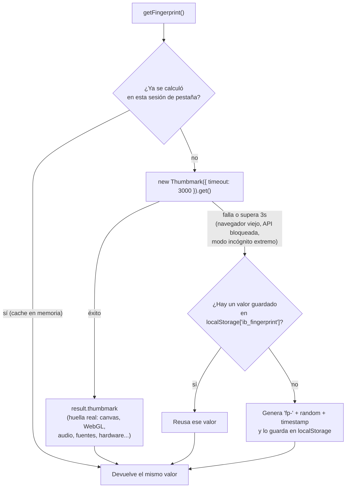
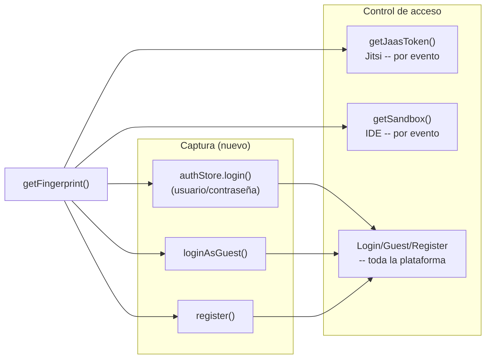
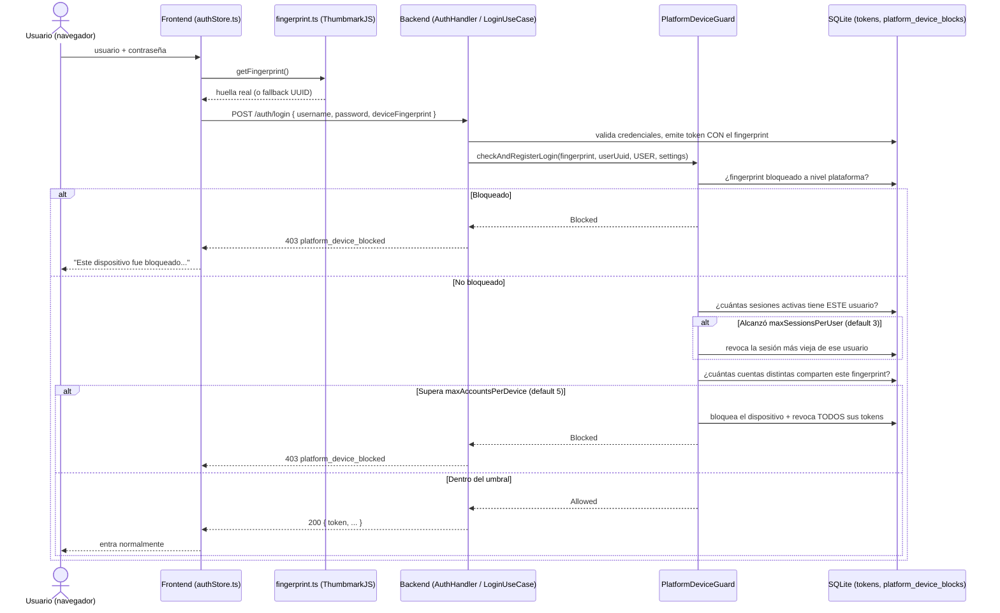
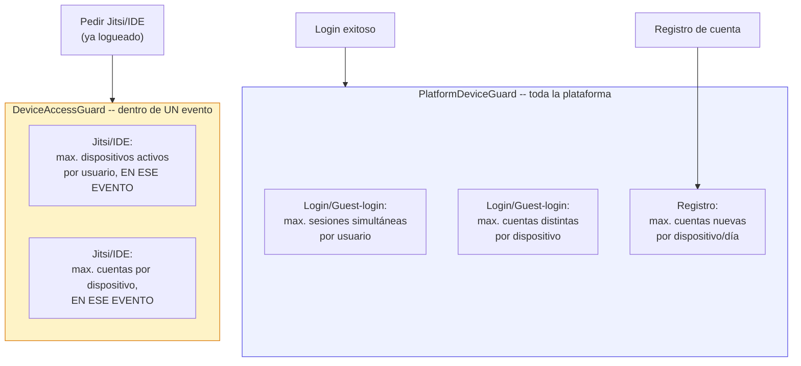

# Fingerprint de dispositivo: cómo funciona (actualizado 2026-07-20)

> **Nota sobre ubicación**: la carpeta `docs/` está marcada como deprecada en este repo
> (ver [`docs/README.md`](README.md)) a favor de `spec-native/`. Este archivo se generó igual
> acá porque se pidió explícitamente en `docs/`.

> Este documento reemplaza la versión anterior (2026-07-19). Desde este cambio, la huella es
> **real** (ThumbmarkJS) y se captura **en el login** (usuario y también invitado), no solo en
> Jitsi/IDE.

## Resumen ejecutivo

**Sí — desde ahora, iniciar sesión SÍ captura la huella del dispositivo.** Tanto el login con
usuario/contraseña como el login de invitado y el registro de cuenta nueva mandan la huella real
del navegador (ThumbmarkJS: canvas, WebGL, audio, fuentes, hardware, etc.), que el backend guarda
junto a la sesión (`tokens.device_fingerprint`).

Con esa huella disponible desde el login, ahora hay **dos niveles** de control de abuso:

1. **Por evento** (`DeviceAccessGuard`, sin cambios de esta ronda) — límite de dispositivos por
   usuario y de cuentas por dispositivo, pero solo mirando Jitsi/IDE **dentro de una conferencia
   puntual**.
2. **A nivel plataforma** (`PlatformDeviceGuard`, nuevo) — el mismo tipo de control pero sin
   importar el evento: cuenta sesiones y cuentas **en toda la plataforma**, y ahora también
   protege el **login/registro en sí**, no solo Jitsi/IDE.

---

## 1. Cómo se genera el fingerprint ahora

Archivo: [`frontend/web/src/services/auth/fingerprint.ts`](../frontend/web/src/services/auth/fingerprint.ts)

Ahora sí se usa la librería real (`@thumbmarkjs/thumbmarkjs`, instalada por npm). El UUID en
`localStorage` sigue existiendo, pero solo como **red de contención** para cuando ThumbmarkJS no
puede terminar a tiempo — ya no es el camino normal.

---

## 2. Dónde se usa hoy

- **Captura**: `authStore.login()`, `loginAsGuest()` (ya la mandaba, ahora es real) y
  `register()` mandan la huella al backend.
- **Persistencia**: se guarda en `tokens.device_fingerprint` (la fila que representa la sesión) y,
  para registro, también en `users.registration_device_fingerprint` (inmutable, fijado una sola
  vez).
- **Control por evento** (sin cambios): `getJaasToken()`/`getSandbox()` siguen mandando el header
  `X-Device-Fingerprint`, evaluado por `DeviceAccessGuard`.
- **Control de plataforma** (nuevo): se evalúa automáticamente en cada login/guest-login/registro,
  sin que el frontend tenga que hacer nada extra más que mandar la huella.

---

## 3. Flujo completo: login con control de plataforma

El mismo patrón aplica a `loginAsGuest()` (con `TokenKind.GUEST`, sin el chequeo de límite de
sesiones) y a `register()` (chequea cuentas creadas desde ese dispositivo en las últimas 24h,
`checkRegistration`, en vez de sesiones).

---

## 4. Dos guards, dos alcances — cómo se relacionan

Un dispositivo puede pasar el control de plataforma (login normal) y aun así ser bloqueado dentro
de un evento específico si abusa solo ahí — y viceversa, un bloqueo de plataforma impide el login
antes de que el usuario llegue siquiera a pedir Jitsi/IDE. Son capas independientes, con sus
propias tablas de bloqueo (`platform_device_blocks` vs `device_blocks`) y sus propias pantallas de
revisión (`/dashboard/admin/device-access` vs `/dashboard/conferences/{id}/device-blocks`).

---

## 5. Qué SÍ nos está ayudando (actualizado)

- **Huella real, no un ID que cualquiera resetea con un click**: ThumbmarkJS combina varias
  señales del navegador (canvas, WebGL, audio, fuentes, hardware) — mucho más difícil de evadir
  que el UUID de `localStorage` de antes (que se perdía con solo borrar datos del sitio).
- **Protege el login/registro en sí**, no solo Jitsi/IDE — un dispositivo bloqueado por abuso no
  puede ni siquiera entrar a la plataforma.
- **Correlaciona abuso entre eventos distintos**: alguien que hace multicuenta repartida en varias
  conferencias distintas para evadir el límite por evento, ahora se detecta igual a nivel
  plataforma.
- **Límite de sesiones simultáneas por usuario**, algo que no existía antes en absoluto.
- **Frena spam de registro de cuentas** desde el mismo dispositivo.
- Todo pasa por la misma cola de revisión humana (`/dashboard/admin/device-access`) — nunca es un
  ban permanente automático sin forma de apelar.

## 6. Qué sigue sin hacer (limitaciones que se mantienen)

- **Sigue sin ser 100% infalsificable.** ThumbmarkJS sube el costo de evadirlo (perfiles de
  navegador distintos, VMs, spoofing de canvas/WebGL) pero un atacante decidido con suficientes
  recursos puede generar huellas distintas a propósito — ningún fingerprinting de navegador es
  perfecto, ThumbmarkJS mismo declara ~80% de unicidad en la población general (su tier gratuito;
  el 99% queda detrás de su API paga, que no integramos).
- **El header/body sigue siendo editable por quien controla su propio navegador** (devtools) — no
  hay firma criptográfica del lado del servidor que ate un fingerprint a "este navegador
  específico, garantizado".
- **No cubre Diagramas/Pizarra/Notas/Encuestas** — el control por evento sigue limitado a
  Jitsi/IDE; el de plataforma solo mira login/guest-login/registro, no cada acción dentro de la
  plataforma.
- **Compus compartidas de laboratorio siguen siendo un caso ambiguo real** — por eso todo bloqueo
  queda en cola de revisión humana en vez de ser automático y definitivo.
